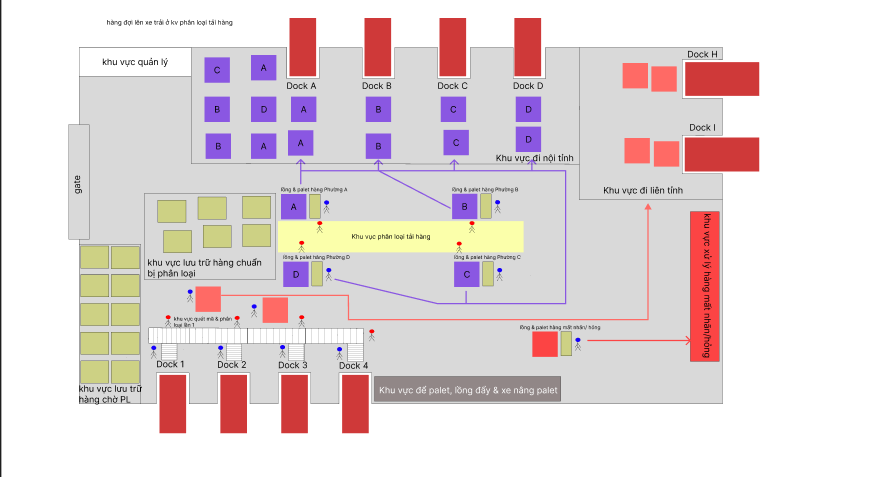
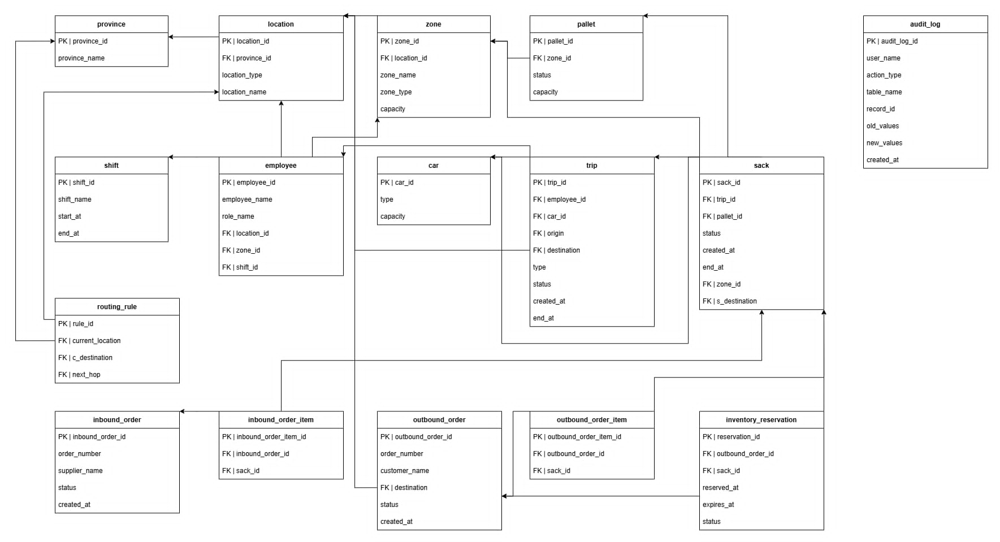

# Warehouse Management System

An academic software engineering project for managing cross-docking warehouse operations from inbound receipt to sorting, palletization, outbound loading, transportation, and final delivery.

The system uses a React web client, an ASP.NET Core REST API, and PostgreSQL. The main tracked unit is a Sack. Every Sack can be scanned, routed, assigned to a Pallet, reserved for an Outbound Order, loaded onto a Trip, and traced through an audit history.

## Project Information

| Field | Value |
| --- | --- |
| Course | Software Engineering |
| Project | Warehouse Management System |
| Project code | WMS |
| Project type | Full-stack web application |
| Team size | Three developers |
| Primary users | Managers, supervisors, warehouse staff, operators, and drivers |
| Repository | https://github.com/hoanfgzang-blip/WMS-.git |

## Problem Statement

Warehouse teams often manage receiving, sorting, temporary storage, dispatch, and transportation through separate records. This creates several risks:

- A Sack can be assigned to the wrong route or Pallet.
- The same Sack can be reserved for more than one Outbound Order.
- Loading and receiving updates can be delayed or entered incorrectly.
- Managers may not have a reliable record of who changed operational data.
- Drivers and warehouse staff may see information outside their assigned hub.

This project provides one workflow and one data source for warehouse and transport operations. Barcode and QR scanning reduce manual input, business rules protect state transitions, and audit records improve traceability.

## Project Objectives

- Digitize the complete warehouse flow from inbound receipt to outbound delivery.
- Support fast barcode and QR scanning on desktop and mobile browsers.
- Route Sacks to the correct local or interprovince processing zone.
- Enforce Pallet capacity, Trip state, and inventory reservation rules.
- Provide role-based and hub-based access control.
- Preserve operational history for review and debugging.
- Deliver a maintainable layered system suitable for future expansion.

## Scope

### Included

- User authentication and account administration
- Role-based and hub-based authorization
- Dashboard metrics and recent activity
- Province, location, hub, zone, and Pallet management
- Employee, shift, vehicle, and driver management
- Inbound Order and Outbound Order management
- Sack creation, scanning, tracking, and state updates
- Local and interprovince sorting
- Pallet assignment, movement, completion, and finalization
- Inventory reservation and duplicate reservation prevention
- Trip planning, QR manifest generation, loading, sealing, dispatch, and check-in
- Driver delivery view
- Append-only audit logging
- Demo data for Hanoi, Ho Chi Minh City, and Da Nang

### Not Included

- Hardware scanner firmware
- Payment and billing processing
- Live GPS tracking
- Automatic vehicle optimization
- Integration with external carrier platforms
- Production monitoring and disaster recovery automation

## Users and Access Control

| Role | Main permissions |
| --- | --- |
| Manager | Full administration, infrastructure, accounts, employees, audit logs, and all warehouse operations |
| Supervisor | Fleet and Trip dispatch plus operational warehouse workflows |
| WarehouseStaff | Inbound, sorting, Pallet, Sack, Outbound Order, loading, and receiving workflows |
| Operator | Operational warehouse workflows with the same warehouse policy boundary |
| Driver | Assigned Trip and delivery information only |

Access is enforced by the backend API. Hiding a menu item in the client is not treated as a security control. Each authenticated account is also associated with an operational hub where applicable.

## Core Features

### Authentication and Administration

- Secure cookie authentication
- Password hashing with PBKDF2 and SHA-256
- Login rate limiting
- Session validation against active account, role, and hub data
- Account activation and deactivation
- Employee, shift, and role management

### Inbound Operations

- Create and manage Inbound Orders
- Associate expected Sacks with an Inbound Order
- Resolve an inbound Trip QR manifest
- Check in an arriving Trip by QR
- Confirm Sack receipt at the destination hub
- Update the interface immediately and report scan success or failure

### Sorting and Pallet Operations

- Scan barcode or QR values through camera or keyboard input
- Preview the calculated sorting route before confirming an action
- Distinguish local flow from interprovince flow
- Assign or reassign a Sack to a Pallet
- Enforce a maximum Pallet capacity of six Sacks
- Move Pallets between operational zones
- Complete sorting and finalize destination-specific Pallets
- Recycle empty Zone C Pallets for later operations

### Outbound Operations

- Create and manage Outbound Orders
- Reserve Sacks for an Outbound Order
- Prevent simultaneous active reservations for the same Sack
- Release or fulfill inventory reservations
- Associate an Outbound Order with a Trip
- Load each Sack through scanning with optimistic interface updates
- Scan a seal code and track loading progress
- Dispatch a Trip using its QR manifest

### Transportation and Delivery

- Manage vehicles, capacity, drivers, and Trip details
- Issue time-limited Trip QR tokens
- Revoke and replace QR tokens when a manifest changes
- View the Trip QR manifest and assigned cargo
- Check in at the receiving hub
- Provide drivers with a focused view of assigned deliveries

### Monitoring and Traceability

- Dashboard totals for Sacks, Orders, active Trips, and sorting work
- Append-only audit records with old and new JSON values
- Real-time Sack location lookup
- Search and filtering across operational screens
- Clear success, warning, and error feedback for scanning actions

## Main Operational Workflow

1. A Manager or Supervisor creates a Trip and assigns a driver and vehicle.
2. The system issues a QR manifest for the Trip.
3. The receiving team scans the Trip QR code and checks in the vehicle.
4. Sacks are confirmed as received and placed in the inbound processing area.
5. Each Sack is scanned and evaluated against its destination and routing rule.
6. Local Sacks move through Zone A and are finalized into Zone B.
7. Interprovince Sacks are directed to Zone C for the next hub.
8. Eligible Sacks are reserved for an Outbound Order.
9. A dispatch Trip is linked to the Outbound Order.
10. Staff scan and load each Sack, scan the seal, and confirm departure by QR.
11. The destination hub checks in the Trip and confirms the received Sacks.
12. The system updates states and writes audit records throughout the workflow.

## Sorting Rules

| Condition | Processing route |
| --- | --- |
| Destination is in the current hub province | Inbound receipt to Zone A to Zone B |
| Destination is in another province | Inbound receipt to Zone C and then the configured next hub |
| No valid route exists | Reject the operation and return a validation message |
| Target Pallet is full | Reject assignment and keep the current Sack state |
| Sack is actively reserved elsewhere | Reject the new reservation |

## Warehouse Floor Plan

The reference layout below illustrates the physical movement of cargo through inbound docks, temporary storage, sorting stations, local handling areas, interprovince handling areas, Pallet staging, and outbound docks.

<div align="center">
  
  <p><em>Figure 1. Sample warehouse floor plan and cargo movement</em></p>
</div>

The layout is a conceptual operating model and is not intended to represent an exact building scale. Its zones correspond to the receiving, sorting, storage, and dispatch responsibilities implemented by the system.

## System Architecture

The solution follows a layered client and server architecture.

| Layer | Responsibility | Main implementation |
| --- | --- | --- |
| Presentation | Pages, forms, tables, scanner interface, and user feedback | React and TypeScript |
| Client integration | Typed requests and session-aware API access | Fetch-based API services |
| API | HTTP endpoints, authorization, request validation, and responses | ASP.NET Core controllers |
| Business logic | Inbound, Outbound, Pallet, routing, tracking, and warehouse workflows | Scoped service classes and interfaces |
| Persistence | Entity mapping, queries, transactions, and migrations | Entity Framework Core |
| Data | Relational records, constraints, indexes, and audit protection | PostgreSQL |

Request flow:

```text
Browser
  -> React application
  -> REST API
  -> Authorization policies
  -> Business services
  -> Entity Framework Core
  -> PostgreSQL
```

The frontend and API run on separate origins during development. Vite proxies requests under `/api` to the backend. A production build can be served from the ASP.NET Core static web root as a single application.

## Functional Decomposition Diagram

The following hierarchy shows how the main system objective is decomposed into operational and supporting functions.

```mermaid
flowchart TB
    WMS["Warehouse Management System"]

    WMS --> OPS["Warehouse Operations"]
    WMS --> LOG["Transport and Delivery"]
    WMS --> RES["Infrastructure and Resources"]
    WMS --> GOV["Administration and Monitoring"]

    OPS --> INB["Inbound Management"]
    OPS --> SRT["Sorting Management"]
    OPS --> OUT["Outbound Management"]

    INB --> INB1["Inbound Orders"]
    INB --> INB2["Trip QR Check-in"]
    INB --> INB3["Sack Receipt"]

    SRT --> SRT1["Barcode and QR Scanning"]
    SRT --> SRT2["Route Determination"]
    SRT --> SRT3["Pallet Assignment"]
    SRT --> SRT4["Pallet Finalization"]

    OUT --> OUT1["Outbound Orders"]
    OUT --> OUT2["Inventory Reservations"]
    OUT --> OUT3["Sack Loading"]
    OUT --> OUT4["Seal and Departure"]

    LOG --> LOG1["Fleet Management"]
    LOG --> LOG2["Trip Planning"]
    LOG --> LOG3["QR Manifest"]
    LOG --> LOG4["Driver Deliveries"]
    LOG --> LOG5["Destination Check-in"]

    RES --> RES1["Provinces and Locations"]
    RES --> RES2["Zones and Pallets"]
    RES --> RES3["Employees and Shifts"]
    RES --> RES4["Routing Rules"]

    GOV --> GOV1["Authentication and Sessions"]
    GOV --> GOV2["Accounts and Permissions"]
    GOV --> GOV3["Dashboard Metrics"]
    GOV --> GOV4["Audit Logs"]
    GOV --> GOV5["Sack Tracking"]
```



## Technology Stack

| Area | Technology |
| --- | --- |
| Frontend | React 19 |
| Language | TypeScript 5.7 |
| Build tool | Vite 6 |
| Styling | Tailwind CSS 3.4 |
| Routing | React Router 7 |
| Charts | Recharts 2 |
| Barcode and QR | ZXing Browser and ZXing Library |
| Backend | ASP.NET Core on .NET 9 |
| Data access | Entity Framework Core 9 |
| Database provider | Npgsql 9 |
| Database | PostgreSQL |
| API documentation | Swagger through Swashbuckle |
| Automated checks | PowerShell smoke test, .NET build, and TypeScript build |

## Database Design

The schema contains eighteen main tables.

| Domain | Tables |
| --- | --- |
| Network | `province`, `location`, `zone`, `routing_rule` |
| Warehouse | `pallet`, `sack` |
| Workforce | `shift`, `employee`, `user_account` |
| Transport | `car`, `trip`, `trip_qr_token` |
| Inbound | `inbound_order`, `inbound_order_item` |
| Outbound | `outbound_order`, `outbound_order_item`, `inventory_reservation` |
| Audit | `audit_log` |

### Conceptual Data Relationship Diagram

The supplied diagram represents the initial database model and its main relationships.

<div align="center">
  
  <p><em>Figure 2. Conceptual data relationship diagram</em></p>
</div>

The implemented schema has since expanded to eighteen tables. It also includes `user_account`, `trip_qr_token`, destination-aware Pallets, next-hop routing fields, and Outbound Order links for Trips. The entity classes, migrations, and `database/database_setup.sql` are the authoritative sources for the current schema.

Important data integrity rules include:

- Foreign keys protect operational relationships.
- Check constraints reject invalid capacity and time values.
- A Trip origin and destination must be different.
- Only one active reservation can exist for a Sack.
- Routing rules are unique for each current location and destination pair.
- Frequently queried state, location, Trip, Pallet, and reservation fields are indexed.
- The audit table is protected against update and delete operations.
- Service operations use database transactions where several records must change together.

## API Overview

All business endpoints are available under `/api`.

| Route group | Responsibility |
| --- | --- |
| `/api/Auth` | Login, logout, session details, and accounts |
| `/api/Dashboard` | Operational summaries and recent activity |
| `/api/Locations` | Hubs and delivery destinations |
| `/api/Zones` | Operational warehouse zones |
| `/api/Pallets` | Pallet assignment, movement, and finalization |
| `/api/Sacks` | Sack queries, routing, sorting, and receipt |
| `/api/InboundOrders` | Inbound Order lifecycle |
| `/api/OutboundOrders` | Outbound Order, reservation, and fulfillment workflows |
| `/api/Trips` | Trip planning, QR manifest, loading, dispatch, and check-in |
| `/api/Cars` | Fleet management |
| `/api/Employees` | Employee management |
| `/api/Shifts` | Shift management |
| `/api/RoutingRules` | Next-hop configuration |
| `/api/AuditLogs` | Audit history and Sack tracking |

Swagger is available in the Development environment at:

```text
http://localhost:5295/swagger
```

## Project Structure

```text
WMS
|-- frontend
|   |-- src
|   |   |-- api
|   |   |-- auth
|   |   |-- components
|   |   |-- lib
|   |   |-- pages
|   |   `-- types
|   |-- package.json
|   `-- vite.config.ts
|-- WMS-
|   |-- Configuration
|   |-- Controllers
|   |-- Data
|   |   |-- Entities
|   |   `-- WmsDbContext.cs
|   |-- Migrations
|   |-- Security
|   |-- Services
|   |-- Program.cs
|   `-- WMS-.csproj
|-- database
|   |-- database_setup.sql
|   |-- demo_seed.sql
|   |-- auth_seed.sql
|   |-- normalize_hubs.sql
|   |-- merge_legacy_zones.sql
|   `-- recycle_empty_zone_c_pallets.sql
|-- docs
|   |-- images
|   |   |-- conceptual-database-erd.png
|   |   `-- warehouse-floor-plan.png
|   |-- KICH_BAN_DEMO_KHO.md
|   `-- KICH_BAN_KIEM_THU.md
|-- tests
|   `-- SmokeTest.ps1
|-- tools
|   |-- WmsTripCli
|   `-- WmsTripSeeder
|-- RUN.bat
|-- WMS-SERVER-START.bat
`-- WMS-.sln
```

## Installation

### Prerequisites

- Git
- .NET 9 SDK
- Node.js 18 or newer
- npm
- PostgreSQL and psql
- A modern browser with camera permission for live scanning

### Clone the Repository

```powershell
git clone https://github.com/hoanfgzang-blip/WMS-.git
Set-Location WMS-
```

### Create and Initialize the Database

Create a PostgreSQL database named `wmsdb` and a login role named `wmsdev`. Choose a local password and keep it outside source control.

The setup script drops existing WMS tables before recreating them. Run it only against a development database or create a backup first.

From the project root, run:

```powershell
psql --host 127.0.0.1 --port 5432 --username wmsdev --dbname wmsdb --file database/database_setup.sql
psql --host 127.0.0.1 --port 5432 --username wmsdev --dbname wmsdb --file database/demo_seed.sql
psql --host 127.0.0.1 --port 5432 --username wmsdev --dbname wmsdb --file database/auth_seed.sql
```

The demo seed is designed to be rerun safely for records whose identifiers begin with `DEMO-`. The authentication seed must be applied after the demo seed. Plaintext demo passwords are not stored in the repository and should be distributed privately by the project team.

### Configure and Run the Backend

Set the database connection for the current PowerShell session:

```powershell
$env:WMS_DB_CONNECTION = 'Host=127.0.0.1;Port=5432;Database=wmsdb;Username=wmsdev;Password=your-password;SSL Mode=Disable'
dotnet restore WMS-.sln
dotnet run --project WMS-/WMS-.csproj --urls http://localhost:5295
```

The backend reads `WMS_DB_CONNECTION` first and then falls back to `ConnectionStrings:DefaultConnection` in the development settings.

### Configure and Run the Frontend

Open a second terminal:

```powershell
Set-Location frontend
npm ci
npm run dev
```

Open the application at:

```text
http://localhost:5173
```

The Vite development server proxies `/api` to `http://localhost:5295`.

To use another API address, set:

```powershell
$env:VITE_API_URL = 'http://localhost:5295/api'
npm run dev
```

### Windows Convenience Runner

After the database is configured, `RUN.bat` starts the backend and frontend in separate windows.

```powershell
./RUN.bat
```

The script currently expects PostgreSQL 18 under `C:\Program Files\PostgreSQL\18` and a local database cluster on port `55432`. Update the script if your installation uses another path or port.

## Build and Verification

### Backend Build

```powershell
dotnet restore WMS-.sln
dotnet build WMS-.sln --configuration Release
```

### Frontend Build

```powershell
Set-Location frontend
npm ci
npm run build
```

### Manual Verification

Use `docs/KICH_BAN_KIEM_THU.md` for the functional checklist and `docs/KICH_BAN_DEMO_KHO.md` for the end-to-end warehouse demonstration.

Recommended acceptance scenarios:

- Successful and failed login
- Permission checks for every role
- Inbound Trip QR check-in
- Barcode and QR Sack scanning
- Local and interprovince sorting
- Pallet capacity rejection
- Duplicate reservation rejection
- Outbound loading and seal scan
- Trip departure and destination check-in
- Audit record creation
- Invalid state transition rejection

### Smoke Test

The repository includes a read-only PowerShell smoke test:

```powershell
powershell -ExecutionPolicy Bypass -File ./tests/SmokeTest.ps1 -BaseUrl http://127.0.0.1:5295
```

Most API routes now require authentication. The current smoke script does not create an authenticated session, so protected checks return `401` until cookie-based login support is added to the script. This limitation should be addressed before using the script in continuous integration.

## Software Engineering Practices

- Layered separation between presentation, API, business logic, and persistence
- Service interfaces for warehouse operations
- Backend authorization independent of frontend navigation
- Database transactions for multi-record business operations
- Input validation and explicit state validation
- Optimistic interface updates with error recovery and scan feedback
- Database constraints as a second line of data protection
- Append-only audit history for accountability
- Seed scripts for repeatable demonstrations
- Manual test scenarios and a basic automated smoke test

## Requirements Traceability

| Requirement | Implementation evidence |
| --- | --- |
| Receive warehouse cargo by scan | Scanner views, Trip QR resolution, check-in endpoints, and Sack receipt logic |
| Sort cargo by destination | Routing rules, sorting route preview, Zone A, Zone B, and Zone C workflows |
| Prevent Pallet overload | Capacity validation in Pallet services and database constraints |
| Prevent duplicate allocation | Unique active reservation index and Outbound Order validation |
| Dispatch cargo safely | Outbound Order linkage, Sack loading, seal scan, and QR departure flow |
| Restrict access | Cookie authentication, role policies, and hub access checks |
| Preserve traceability | Audit log records with old values, new values, user, and time |
| Support demonstration | Demo seed, authentication seed, demo script, and test checklist |

## Current Limitations

- Automated unit, integration, and browser test coverage is limited.
- The smoke test does not yet authenticate against protected endpoints.
- Local launch scripts contain Windows-specific paths and ports.
- Camera scanning depends on browser permission and a secure context such as localhost or HTTPS.
- Operational text in the current web interface is primarily Vietnamese.
- The project does not provide live GPS, external carrier integration, or production observability.
- Database initialization is script-based and requires careful environment selection.

## Future Development

- Add unit tests for routing, Pallet capacity, Trip states, and reservations.
- Add authenticated API integration tests and end-to-end browser tests.
- Add container-based development and deployment.
- Add continuous integration for backend build, frontend build, and tests.
- Add structured logging, health checks, metrics, and alerting.
- Add offline-friendly scanning and queued synchronization.
- Add live vehicle location and carrier integration.
- Add configurable Pallet rules and route optimization.
- Add bilingual Vietnamese and English interface support.

## Team Contributions

### Phạm Duy Anh — Developer C

- Developed and integrated the Scanner UI.
- Implemented barcode and QR scanning workflows for inbound and outbound operations.
- Developed Trip QR scanning and outbound loading interactions.
- Implemented optimistic UI updates, API integration, and scanning result feedback.
- Participated in functional testing and UI refinement.

### Lê Hoàng Giang — Developer C

- Developed the Trip QR Manifest and inbound scanning workflow.
- Refactored frontend and backend components.
- Integrated pallet-related APIs.
- Improved authentication and input validation logic.
- Participated in system integration, debugging, documentation, and testing.

### Trần Quang Khải — Developer B

- Developed the core backend and warehouse business logic.
- Implemented Sack, Pallet, Trip, Outbound Order, routing, sorting, and pallet finalization workflows.
- Developed database entities and API endpoints.
- Implemented database transactions and state validation.
- Integrated Sack and Pallet data with Outbound Orders.
- Participated in code review and backend testing.

## Academic Evaluation Summary

This project demonstrates requirements analysis, modular architecture, relational data modeling, API design, frontend and backend integration, role-based security, transaction management, validation, testing, and team collaboration. The implementation addresses a realistic warehouse problem while keeping the design extensible for future logistics features.

## Repository Use

This repository is an academic project. It does not currently declare an open-source license. Use and redistribution require permission from the project team.
