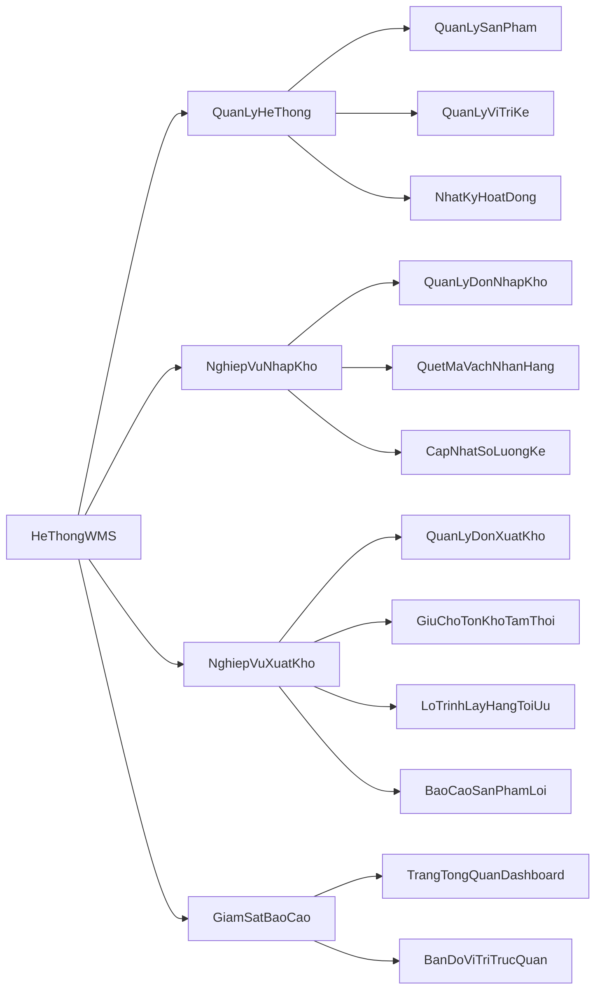

# Hệ thống quản lý kho vận WMS

Hệ thống quản lý kho hàng hiện đại WMS được xây dựng trên nền tảng Blazor Interactive Server chạy trên bản .NET 9.0 kết hợp với Entity Framework Core và cơ sở dữ liệu SQLite. Dự án được thiết kế chuẩn chỉnh theo mô hình hướng dịch vụ giúp tối ưu hóa toàn bộ các hoạt động vận hành nhập xuất kho và quản lý sơ đồ kệ hàng thời gian thực.

---

## Các Tính Năng Nổi Bật

* **Sơ đồ kệ hàng trực quan**: Theo dõi tỉ lệ lấp đầy của từng kệ dưới dạng bản đồ nhiệt. Lựa chọn kệ để xem chi tiết sản phẩm và số lượng đang lưu trữ.
* **Quy trình nhập kho tinh gọn**: Quản lý đơn đặt hàng và quét mã vạch nhận hàng thực tế.
* **Logic xuất kho thông minh**:
  * **Cơ chế giữ chỗ tồn kho** có thời hạn mười hai giờ.
  * **Lập lộ trình lấy hàng tối ưu** tự động sắp xếp theo thứ tự lối đi giúp nhân viên di chuyển ngắn nhất.
  * Hỗ trợ báo cáo lỗi ngoại quan sản phẩm và tự động tìm kiếm vị trí thay thế gần nhất.
* **Nhật ký hệ thống tối bảo mật**: Ghi lại chi tiết mọi hoạt động thay đổi dữ liệu của nhân viên như ai sửa, sửa lúc nào, giá trị cũ và mới dưới dạng chỉ cho phép ghi thêm phục vụ công tác thanh tra.

---

## Công Nghệ Sử Dụng

* **Giao diện**: HTML5, Vanilla CSS, Tailwind CSS, Blazor Components.
* **Hệ thống phía sau**: ASP.NET Core Blazor Server chạy trên bản .NET 9.0.
* **Tầng dữ liệu**: SQLite Database, Entity Framework Core làm công cụ liên kết cơ sở dữ liệu.
* **Biểu tượng**: Google Material Symbols.

---

## Sơ Đồ Phân Cấp Chức Năng



---

## Cấu Trúc Thư Mục Dự Án

```text
├── WMS-                       # Thư mục chứa mã nguồn chính
│   ├── Components/            # Giao diện Blazor Components
│   │   ├── Pages/             # Các trang nghiệp vụ như Dashboard, Bản đồ, Sản phẩm
│   │   └── Layout/            # Layout trang trí và thanh điều hướng Navigation
│   ├── Data/                  # Tầng truy cập dữ liệu
│   │   ├── Entities/          # Các thực thể C# ánh xạ tới bảng trong Database
│   │   └── WmsDbContext.cs    # Cấu hình kết nối DB và Khởi tạo dữ liệu mẫu
│   ├── Services/              # Các dịch vụ xử lý logic nghiệp vụ kho
│   │   ├── InventoryService.cs
│   │   ├── InboundService.cs
│   │   └── OutboundService.cs
│   ├── Program.cs             # Cấu hình khởi chạy ứng dụng
│   └── WMS-.csproj            # Khai báo các thư viện phụ thuộc
├── WMS-.sln                   # File Solution quản lý dự án .NET
```

---

## Hướng Dẫn Cài Đặt và Chạy Dự Án

### Yêu Cầu Hệ Thống
* Đã cài đặt .NET 9.0 SDK. Tải về tại đường dẫn https://dotnet.microsoft.com/download/dotnet/9.0

### Các Bước Thực Hiện
1. **Tải dự án**:
   ```bash
   git clone https://github.com/hoanfgzang-blip/WMS-.git
   cd WMS-
   ```
2. **Khôi phục thư viện và dựng dự án**:
   ```bash
   dotnet restore
   dotnet build
   ```
3. **Chạy ứng dụng**:
   ```bash
   dotnet run --project WMS-/WMS-.csproj
   ```
4. **Truy cập giao diện**:
   Mở trình duyệt và truy cập đường dẫn được hiển thị trên bảng điều khiển, ví dụ như http://localhost:5000

*Lưu ý: Cơ sở dữ liệu SQLite sẽ tự động được tạo và điền dữ liệu mẫu ngay trong lần chạy đầu tiên.*
