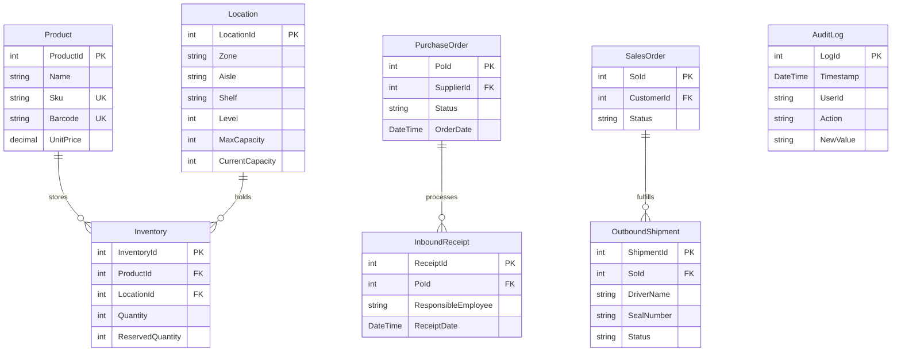

# 📦 Warehouse Management System (WMS)

[](https://dotnet.microsoft.com/)
[](https://learn.microsoft.com/en-us/aspnet/core/blazor/)
[](https://www.sqlite.org/)
[](https://learn.microsoft.com/en-us/ef/core/)

Hệ thống quản lý kho hàng hiện đại (WMS) được xây dựng trên nền tảng **Blazor Interactive Server (.NET 9.0)** kết hợp **Entity Framework Core** và cơ sở dữ liệu **SQLite**. Dự án được thiết kế chuẩn chỉnh theo mô hình dịch vụ (Service-oriented) giúp tối ưu hóa toàn bộ các hoạt động vận hành nhập/xuất kho và quản lý sơ đồ kệ hàng thời gian thực.

---

## 🚀 Tính Năng Nổi Bật

* **Sơ đồ kệ hàng trực quan (Interactive Floor Plan)**: Theo dõi tỉ lệ lấp đầy (Capacity fill-rate) của từng Zone/Aisle/Shelf dưới dạng heatmap. Click chọn kệ để xem chi tiết sản phẩm và số lượng đang lưu trữ.
* **Quy trình nhập kho tinh gọn (Inbound flow)**: Quản lý nhà cung cấp, đơn đặt hàng (Purchase Orders) và quét mã vạch nhận hàng thực tế.
* **Logic xuất kho thông minh (Outbound Flow)**:
  * **Cơ chế giữ chỗ tồn kho (Hold Reservation)** có thời hạn 12 giờ.
  * **Lập lộ trình lấy hàng tối ưu (Optimized Picking Route)** tự động sắp xếp theo thứ tự lối đi (Aisle) giúp nhân viên di chuyển ngắn nhất.
  * Hỗ trợ báo cáo lỗi ngoại quan sản phẩm, tự động tìm kiếm vị trí thay thế gần nhất.
* **Nhật ký hệ thống tối bảo mật (Audit Logs)**: Ghi lại chi tiết mọi hoạt động thay đổi dữ liệu của nhân viên (ai sửa, sửa lúc nào, giá trị cũ/mới) dưới dạng *chỉ cho phép ghi thêm (Append-only)* phục vụ công tác thanh tra.

---

## 🛠️ Công Nghệ Sử Dụng

* **Frontend**: HTML5, Vanilla CSS, Tailwind CSS (Utility classes), Blazor Components.
* **Backend**: ASP.NET Core Blazor Server (.NET 9.0).
* **Database & Access Layer**: SQLite Database, Entity Framework Core (ORM).
* **Icons**: Google Material Symbols.

---

## 📐 Kiến Trúc Cơ Sở Dữ Liệu (ERD)



---

## 📂 Cấu Trúc Thư Mục Dự Án

```text
├── WMS-                       # Thư mục chứa mã nguồn chính
│   ├── Components/            # Giao diện Blazor Components
│   │   ├── Pages/             # Các trang nghiệp vụ (Dashboard, Map, Products...)
│   │   └── Layout/            # Layout trang trí và thanh điều hướng Navigation
│   ├── Data/                  # Tầng truy cập dữ liệu
│   │   ├── Entities/          # Các thực thể C# ánh xạ tới bảng trong Database
│   │   └── WmsDbContext.cs    # Cấu hình kết nối DB & Khởi tạo dữ liệu mẫu (Seeding)
│   ├── Services/              # Các dịch vụ xử lý logic nghiệp vụ kho
│   │   ├── InventoryService.cs
│   │   ├── InboundService.cs
│   │   └── OutboundService.cs
│   ├── Program.cs             # Cấu hình khởi chạy ứng dụng & Dependency Injection
│   └── WMS-.csproj            # Khai báo các thư viện phụ thuộc (Nuget Packages)
├── WMS-.sln                   # File Solution quản lý dự án .NET
└── Xuất kho.md                # Tài liệu chi tiết về quy chuẩn quy trình xuất kho
```

---

## 💻 Hướng Dẫn Cài Đặt & Chạy Dự Án

### Yêu Cầu Hệ Thống
* Đã cài đặt **.NET 9.0 SDK** ([Tải về tại đây](https://dotnet.microsoft.com/download/dotnet/9.0)).

### Các Bước Thực Hiện
1. **Clone dự án**:
   ```bash
   git clone https://github.com/hoanfgzang-blip/WMS-.git
   cd WMS-
   ```
2. **Khôi phục thư viện và build dự án**:
   ```bash
   dotnet restore
   dotnet build
   ```
3. **Chạy ứng dụng**:
   ```bash
   dotnet run --project WMS-/WMS-.csproj
   ```
4. **Truy cập giao diện**:
   Mở trình duyệt và truy cập đường dẫn được hiển thị trên console (mặc định là `http://localhost:5000` hoặc `https://localhost:5001`). 

*Lưu ý: Cơ sở dữ liệu SQLite (`wms.db`) sẽ tự động được tạo và điền dữ liệu mẫu ngay trong lần chạy đầu tiên.*
